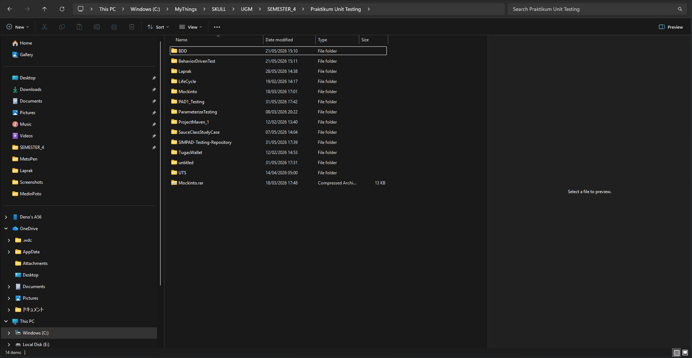
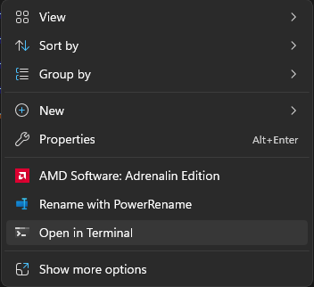
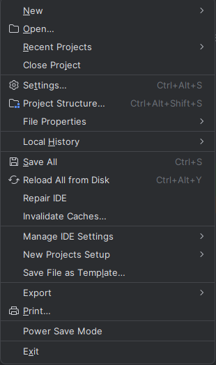
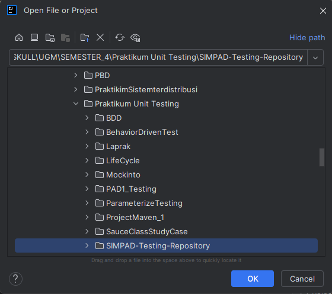
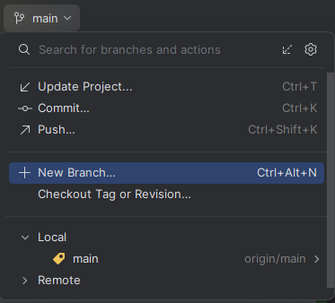
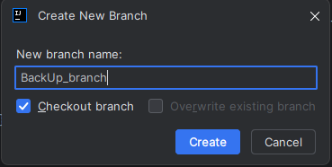
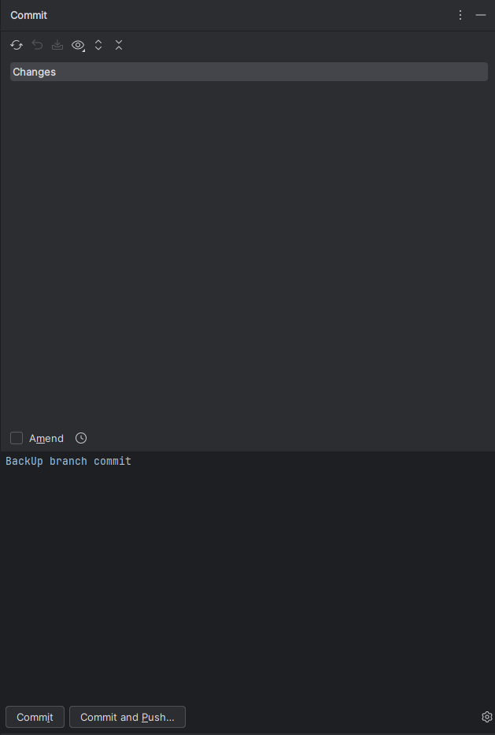
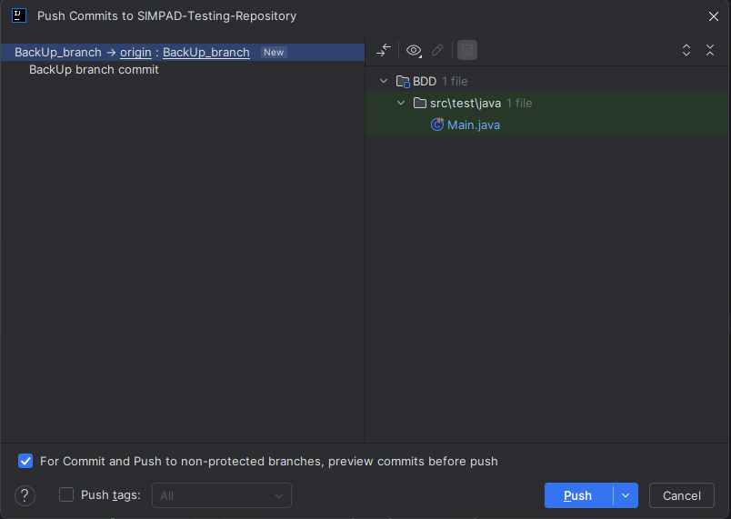

# SIMPAD Testing Repository — Setup Guide

Panduan ini menjelaskan langkah-langkah untuk melakukan clone, menjalankan, dan berkontribusi ke repository SIMPAD Testing menggunakan IntelliJ IDEA.

---

## Prasyarat

Pastikan perangkat sudah terinstall:

- [Git](https://git-scm.com/downloads) — untuk cloning dan version control
- [IntelliJ IDEA](https://www.jetbrains.com/idea/download/) — IDE utama untuk menjalankan project
- [Google Chrome](https://www.google.com/chrome/) — diperlukan oleh ChromeDriver untuk Selenium testing
- [ChromeDriver](https://chromedriver.chromium.org/downloads) — versi harus sesuai dengan versi Chrome yang terinstall
- Java Development Kit (JDK) — versi 11 ke atas

---

## Langkah 1 — Clone Repository

### 1.1 Pilih Folder Tujuan

Navigasi ke folder di mana project ingin disimpan, lalu buka terminal di folder tersebut dengan cara klik kanan → **Open in Terminal**.





### 1.2 Clone Repository

Jalankan perintah berikut di terminal:

```bash
git clone https://github.com/mat-te123/SIMPAD-Testing-Repository.git
```

Setelah selesai, folder `SIMPAD-Testing-Repository` akan muncul di direktori yang dipilih.

---

## Langkah 2 — Membuka dan Menjalankan Project

### 2.1 Buka Project di IntelliJ IDEA

1. Buka **IntelliJ IDEA**.
2. Klik **Open** di pojok kiri atas.

   

3. Arahkan ke folder hasil clone, lalu klik **OK**.

   

4. Tunggu hingga IntelliJ selesai mengindeks project dan mengunduh dependencies.

### 2.2 Verifikasi Clone Berhasil

Untuk memastikan project berjalan dengan benar, jalankan test yang ada di `test/Main.java`:

```java
@Test
public void WebTesting() {
    WebDriver driver = new ChromeDriver();
    driver.manage().window().maximize();
    driver.get("https://simpad-frontend.vercel.app/");
    WebElement Hero = driver.findElement(By.id("Upper"));

    if (Hero.isDisplayed() && Hero.isEnabled()) {
        System.out.println("Success");
    } else {
        System.out.println("Error");
    }
}
```

> ✅ **Jika output menampilkan `Success`**, project berhasil di-clone dan Selenium dapat mengakses halaman web SIMPAD.
>
> ❌ **Jika output menampilkan `Error`**, periksa koneksi internet, pastikan ChromeDriver sudah dikonfigurasi, dan halaman `https://simpad-frontend.vercel.app/` dapat diakses.

---

## Langkah 3 — Membuat Branch Baru

> [!WARNING]
> **Langkah ini sangat penting!** Jangan langsung bekerja di branch `main`. Selalu buat branch baru untuk setiap fitur atau perubahan agar tidak terjadi conflict dengan pekerjaan anggota tim lainnya.

### 3.1 Buat Branch dari IntelliJ

1. Perhatikan pojok kiri atas IntelliJ — saat pertama kali clone, nama branch akan tertulis **main**.

   

2. Klik nama branch tersebut, lalu pilih **New Branch**.
3. Beri nama branch sesuai fitur yang sedang dikerjakan. Contoh: `feature/login-test`, `fix/button-validation`, atau `backup_branch`.

   

4. Setelah dibuat, nama branch di pojok kiri atas akan berubah menjadi nama branch yang baru.

### 3.2 Tambahkan Test Baru di Branch

Sebagai tanda bahwa branch baru sudah aktif, tambahkan test berikut ke file `/test/Main.java`:

```java
@Test
public void BranchTesting() {
    WebDriver driver = new ChromeDriver();
    driver.manage().window().maximize();
    driver.get("https://simpad-frontend.vercel.app/");
    WebElement Hero = driver.findElement(By.id("Upper"));

    if (Hero.isDisplayed() && Hero.isEnabled()) {
        System.out.println("Branch baru aktif dan berjalan.");
    } else {
        System.out.println("Error: Elemen tidak ditemukan.");
    }
}
```

---

## Langkah 4 — Commit dan Push

### 4.1 Buka Panel Version Control

Di IntelliJ, klik ikon **Version Control** (terletak di sidebar kiri, di bawah ikon folder).



### 4.2 Commit Perubahan

1. Centang file-file yang ingin di-commit.
2. Tuliskan pesan commit yang deskriptif. Contoh: `Add BranchTesting for backup_branch verification`.
3. Klik **Commit and Push**.

### 4.3 Konfirmasi Push

Sebuah dialog konfirmasi akan muncul yang menampilkan branch tujuan push.



Pastikan branch yang ditampilkan sudah benar (misalnya `backup_branch`), lalu klik **Push**.

---

## Konvensi Penamaan Branch

Gunakan konvensi berikut agar repository tetap terorganisir:

| Tipe         | Format Nama Branch          | Contoh                    |
|--------------|-----------------------------|---------------------------|
| Fitur baru   | `feature/<nama-fitur>`      | `feature/login-test`      |
| Perbaikan bug | `fix/<nama-bug>`            | `fix/button-click-error`  |
| Backup/arsip | `backup/<nama-atau-tanggal>` | `backup/before-refactor`  |

---

## Troubleshooting

| Masalah | Kemungkinan Penyebab | Solusi |
|--------|----------------------|--------|
| `git clone` gagal | Git belum terinstall atau tidak ada koneksi | Pastikan Git terinstall dan cek koneksi internet |
| Test output `Error` | ChromeDriver tidak sesuai versi Chrome | Update ChromeDriver agar versi sesuai |
| Branch tidak muncul setelah push | Belum dikonfirmasi di dialog push | Ulangi push dan pastikan dialog dikonfirmasi |
| IntelliJ tidak mengenali project | Folder yang dibuka salah | Pastikan folder yang dibuka adalah root project (berisi `pom.xml` atau `build.gradle`) |